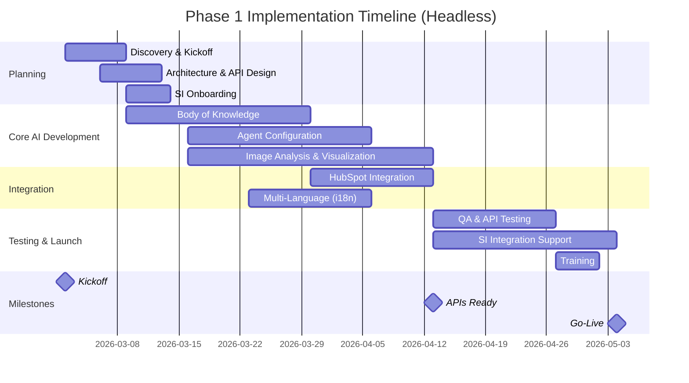

# Dovista (Mockfjord) - Project Estimate

> [!info] Estimate Basis
> Based on [[Dovista - Project Scope - 2026-02-05]] recommended options. Blended rate: **€188.96/hour** (USD $225 × 0.8398). Includes 15% PM time and QA/Testing allocation. **Headless delivery** — customer SI handles front-end.

## Executive Summary

| Metric | Phase 1 | Phase 2 | Total |
|--------|---------|---------|-------|
| **Estimated Hours** | 524 | 164 | 688 |
| **Blended Rate** | €188.96/hour | €188.96/hour | €188.96/hour |
| **Estimated Cost** | €98,972.82 | €30,988.62 | €129,962.04 |
| **Timeline** | 8-10 weeks | 4-6 weeks | — |

**Phase 1 Go-Live Target:** Mid-May 2026

---

## Delivery Model: Headless / API-First

Threekit delivers backend AI services, APIs, and integration support. Customer's third-party Systems Integrator (SI) builds the front-end user interface.

**Threekit Delivers:**
- AI Visual Discovery platform & APIs
- Image analysis & window detection services
- Recommendation engine & lead intelligence
- HubSpot integration
- Multi-language i18n framework
- SI consulting & integration support (40 hours)

**Customer SI Delivers:**
- Front-end UI design & development
- Website integration
- User experience implementation

---

## Phase 1: AI Visual Discovery (Headless)

### Work Area Breakdown

| Work Area | Hours | Cost |
|-----------|-------|------|
| 1. Discovery & Planning | 32 | €6,046.56 |
| 2. AI Body of Knowledge | 80 | €15,116.40 |
| 3. AI Agent Configuration | 72 | €13,604.76 |
| 4. Image Analysis & Visualization | 120 | €22,674.60 |
| 5. Lead Intelligence & HubSpot Integration | 56 | €10,581.48 |
| 6. Multi-Language (i18n Framework) | 60 | €11,337.30 |
| 7. QA & Testing | 40 | €7,558.20 |
| 8. SI Consulting & Integration Support | 40 | €7,558.20 |
| 9. Training & Documentation | 24 | €4,534.92 |
| **Phase 1 Total** | **524** | **€98,972.82** |

---

### Detailed Hours by Role (Phase 1)

| Role | Rate | % of Phase 1 | Hours | Cost |
|------|------|--------------|-------|------|
| Project Manager | €188.96 | 15% | 78 | €14,738.49 |
| Solution Architect / Consultant | €188.96 | 28% | 147 | €27,776.39 |
| Forward Deployed Engineer | €188.96 | 42% | 220 | €41,570.10 |
| QA Engineer | €188.96 | 15% | 79 | €14,926.85 |
| **Total** | | **100%** | **524** | **€98,972.82** |

*Note: No Front-End Developer allocation in Phase 1 (headless delivery)*

---

### Detailed Breakdown by Work Area (Phase 1)

#### 1. Discovery & Planning (32 hours)

| Task | PM | SA | FDE | QA | Total |
|------|-----|-----|-----|-----|-------|
| Kickoff meeting & requirements review | 4 | 4 | 2 | 0 | 10 |
| Technical architecture design | 2 | 8 | 4 | 0 | 14 |
| API specification & SI onboarding | 2 | 4 | 2 | 0 | 8 |
| **Subtotal** | **8** | **16** | **8** | **0** | **32** |

#### 2. AI Body of Knowledge (80 hours)

| Task | PM | SA | FDE | QA | Total |
|------|-----|-----|-----|-----|-------|
| Product data audit & extraction | 4 | 8 | 16 | 0 | 28 |
| Attribute mapping & taxonomy design | 2 | 12 | 8 | 0 | 22 |
| House style knowledge base creation | 2 | 8 | 10 | 0 | 20 |
| Image curation for inspiration | 2 | 2 | 4 | 2 | 10 |
| **Subtotal** | **10** | **30** | **38** | **2** | **80** |

#### 3. AI Agent Configuration (72 hours)

| Task | PM | SA | FDE | QA | Total |
|------|-----|-----|-----|-----|-------|
| Agent persona & tone definition | 2 | 8 | 4 | 0 | 14 |
| Discovery flow configuration | 2 | 8 | 12 | 0 | 22 |
| Recommendation logic setup | 2 | 8 | 12 | 0 | 22 |
| Calibration & tuning (2 rounds) | 2 | 4 | 6 | 2 | 14 |
| **Subtotal** | **8** | **28** | **34** | **2** | **72** |

#### 4. Image Analysis & Visualization (120 hours)

| Task | PM | SA | FDE | QA | Total |
|------|-----|-----|-----|-----|-------|
| AI window detection configuration | 4 | 8 | 24 | 4 | 40 |
| Swedish house type training | 2 | 4 | 16 | 2 | 24 |
| Visualization rendering pipeline | 4 | 8 | 20 | 8 | 40 |
| Facade color change capability | 2 | 2 | 6 | 2 | 12 |
| API endpoint development | 0 | 0 | 4 | 0 | 4 |
| **Subtotal** | **12** | **22** | **70** | **16** | **120** |

#### 5. Lead Intelligence & HubSpot Integration (56 hours)

| Task | PM | SA | FDE | QA | Total |
|------|-----|-----|-----|-----|-------|
| Session tracking configuration | 2 | 4 | 8 | 2 | 16 |
| HubSpot API integration | 2 | 4 | 12 | 4 | 22 |
| Lead enrichment field mapping | 2 | 4 | 4 | 2 | 12 |
| Basic lead export implementation | 2 | 0 | 2 | 2 | 6 |
| **Subtotal** | **8** | **12** | **26** | **10** | **56** |

#### 6. Multi-Language i18n Framework (60 hours)

Languages: Swedish, Norwegian, Danish, English, French, Polish, Finnish

| Task | PM | SA | FDE | QA | Total |
|------|-----|-----|-----|-----|-------|
| i18n framework & architecture | 2 | 4 | 8 | 0 | 14 |
| API localization layer | 2 | 2 | 8 | 2 | 14 |
| Content key structure (7 languages) | 2 | 4 | 8 | 2 | 16 |
| Multi-language API testing | 2 | 0 | 4 | 10 | 16 |
| **Subtotal** | **8** | **10** | **28** | **14** | **60** |

#### 7. QA & Testing (40 hours)

| Task | PM | SA | FDE | QA | Total |
|------|-----|-----|-----|-----|-------|
| Test plan development | 4 | 4 | 0 | 8 | 16 |
| API & integration testing | 2 | 0 | 4 | 10 | 16 |
| SI acceptance support | 2 | 0 | 2 | 4 | 8 |
| **Subtotal** | **8** | **4** | **6** | **22** | **40** |

#### 8. SI Consulting & Integration Support (40 hours)

| Task | PM | SA | FDE | QA | Total |
|------|-----|-----|-----|-----|-------|
| API documentation | 2 | 4 | 8 | 0 | 14 |
| SI technical workshops (2x) | 4 | 8 | 4 | 0 | 16 |
| Integration troubleshooting | 2 | 2 | 4 | 2 | 10 |
| **Subtotal** | **8** | **14** | **16** | **2** | **40** |

#### 9. Training & Documentation (24 hours)

| Task | PM | SA | FDE | QA | Total |
|------|-----|-----|-----|-----|-------|
| Admin training sessions (2x) | 4 | 4 | 0 | 0 | 8 |
| Platform documentation | 2 | 2 | 2 | 2 | 8 |
| API documentation & guides | 2 | 2 | 2 | 2 | 8 |
| **Subtotal** | **8** | **8** | **4** | **4** | **24** |

---

### Phase 1 Hours Summary by Role

| Role | Discovery | BoK | Agent | Image | HubSpot | i18n | QA | SI Support | Training | **Total** |
|------|-----------|-----|-------|-------|---------|------|-----|------------|----------|-----------|
| PM | 8 | 10 | 8 | 12 | 8 | 8 | 8 | 8 | 8 | **78** |
| SA | 16 | 30 | 28 | 22 | 12 | 10 | 4 | 14 | 8 | **147** |*
| FDE | 8 | 38 | 34 | 70 | 26 | 28 | 6 | 16 | 4 | **220** |*
| QA | 0 | 2 | 2 | 16 | 10 | 14 | 22 | 2 | 4 | **79** |*
| **Total** | **32** | **80** | **72** | **120** | **56** | **60** | **40** | **40** | **24** | **524** |

*Totals verified: 78 + 147 + 220 + 79 = 524 ✓*

---

## Phase 2: Product Configuration & Quotes (Future)

| Work Area | Hours | Cost |
|-----------|-------|------|
| Product Configuration (Advanced) | 72 | €13,604.76 |
| Quote Generation (PDF + Interactive) | 72 | €13,604.76 |
| Additional SI Integration Support | 20 | €3,779.10 |
| **Phase 2 Total** | **164** | **€30,988.62** |

*Phase 2 estimate provided for planning purposes. SOW covers Phase 1 only.*

---

## Investment Summary

### Phase 1 Investment

| Item | Amount |
|------|--------|
| Professional Services | €98,972.82 |
| Platform Subscription (Annual)* | TBD |
| **Total Phase 1** | **€98,972.82 + Platform** |

*Platform subscription pricing to be provided separately based on usage tier.

### Payment Terms (Standard)

| Milestone | % | Amount |
|-----------|---|--------|
| Contract Signature | 40% | €39,604.97 |
| Beta Ready | 30% | €29,703.73 |
| Go-Live | 30% | €29,703.73 |
| **Total** | **100%** | **€98,972.82** |

---

## Timeline

### Phase 1 Timeline (8-10 weeks)

**Key Milestones:**
- **Mar 2** — Kickoff
- **Apr 13** — APIs Ready (SI can complete integration)
- **Early May** — Go-Live

---

## Assumptions & Exclusions

### Assumptions
- Customer provides product data in structured format within 1 week of kickoff
- Mockfjord brand guidelines and assets available at project start
- HubSpot instance provisioned and accessible
- Customer SI available for API integration starting Week 2
- All language content (Swedish, Norwegian, Danish, English, French, Polish, Finnish) provided by customer
- SI handles all front-end UI development

### Exclusions (Phase 1)
- Front-end UI design & development (SI responsibility)
- Product configurator (Phase 2)
- Quote generation - PDF & interactive (Phase 2)
- Platform subscription fees (quoted separately)
- SAP/ERP integration (pending S4 migration completion)
- Photo-realistic 3D rendering
- Ongoing maintenance and support (separate agreement)

---

*Estimate valid for 30 days. Subject to scope confirmation.*

*All amounts in EUR (USD × 0.8398, rate as of Feb 11, 2026).*

*Prepared by Threekit Pre-Sales | February 5, 2026*
