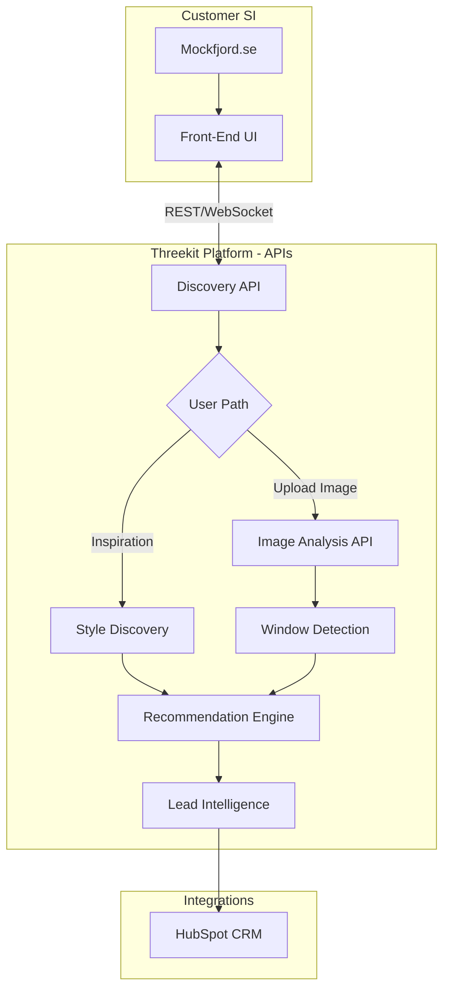
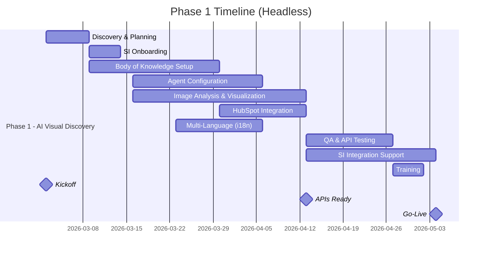

# Dovista - Project Scope

> [!info] Document Purpose
> Confirmed scope for the Mockfjord AI Visual Discovery pilot (Phase 1). See [[Dovista - Scoping Notes - 2026-02-05]] for detailed requirements and [[Dovista - Project Estimate - 2026-02-05]] for hours and pricing.

## Executive Summary

Dovista seeks to implement an AI-powered visual discovery experience for their Mockfjord brand, targeting residential homeowners across Nordic and European markets. Phase 1 delivers the **AI Visual Discovery platform** (image upload, window detection, style-based recommendations) through a **headless/API-first architecture** — enabling Dovista's chosen Systems Integrator (SI) to build the front-end user interface.

Phase 2 will add product configuration and quote generation capabilities.

**Project Type:** AI Visual Discovery (Headless/API-First)

---

## Headless Architecture

**Threekit Delivers:** Backend AI services, APIs, HubSpot integration, SI consulting
**Customer SI Delivers:** Front-end UI design, development, and website integration

---

## Phase 1 Scope Summary

| Work Area | Scope | Description |
|-----------|-------|-------------|
| 1. AI Body of Knowledge | **Full Service** | Threekit handles complete data prep, taxonomy, knowledge base |
| 2. AI Agent Configuration | **Standard Flow** | Inspiration + image upload paths, B2C-focused |
| 3. Image Analysis & Visualization | **Enhanced** | Facade changes + multi-story buildings (up to 44 windows) |
| 4. Lead Intelligence | **HubSpot Deep Integration** | Full CRM integration with lead enrichment |
| 5. Multi-Language | **7 Languages (i18n)** | API-level localization framework |
| 6. SI Consulting | **40 Hours** | API docs + integration support |
| 7. Training | **Standard + API** | Admin training + API documentation |

---

## Phase 2 Scope (Future)

| Work Area | Scope | Description |
|-----------|-------|-------------|
| Product Configuration | **Advanced** | Full accessories, facade-specific options, validation |
| Quote Generation | **PDF + Interactive** | Both PDF and shareable digital quotes |
| Additional SI Support | **20 Hours** | Configuration API integration |

---

## Detailed Scope by Work Area (Phase 1)

### 1. AI Body of Knowledge (Full Service)

Threekit handles complete data preparation and knowledge base construction.

**Includes:**
- Product data extraction and transformation
- Attribute mapping and taxonomy design
- House style knowledge base creation (traditional, modern, 1970s-80s brutalist, contemporary)
- Regional preference rules (Nordic markets)
- Image curation for inspiration gallery
- Quality assurance and validation

**Does not include:**
- Ongoing data maintenance (separate support contract)
- Integration with SAP S4 (handled separately when migration complete)

---

### 2. AI Agent Configuration (Standard Flow)

Discovery journey optimized for residential homeowners with two entry paths.

**Includes:**
- **Inspiration Path:** Style preference discovery (traditional, modern, 1970s-80s, contemporary)
- **Image Upload Path:** AI-powered window detection and analysis
- Basic profiling inputs (color, material, energy, opening type)
- Product recommendation engine
- API endpoints for all discovery interactions
- 2 rounds of calibration tuning

**Does not include:**
- B2B/multi-story building flow (Phase 2+)
- Complex multi-persona routing

---

### 3. Image Analysis & Visualization (Enhanced)

Full visualization capabilities including facade changes, delivered via API.

**Includes:**
- AI window detection (residential homes, up to 44 windows)
- Window placement with perspective matching
- Lighting/shadow adjustment
- Exterior view rendering
- Before/after comparison generation
- Facade/siding color change capability
- Multi-story building support
- Enhanced Swedish/Nordic house style recognition
- Close-up detail views
- **All capabilities exposed via REST API**

**Does not include:**
- Photo-realistic 3D rendering (requires additional 3D asset work)
- Interior views

---

### 4. Lead Intelligence & HubSpot Integration

Full integration with HubSpot including enriched lead data and basic session export.

**Includes:**
- Session analytics tracking (views, interactions, completions)
- Lead capture data structure
- HubSpot CRM integration (contacts, deals)
- Custom property mapping for lead intelligence
- Automated lead scoring signals
- Session data export to HubSpot
- Sales notification triggers
- **Basic lead export API** for session summaries

---

### 5. Multi-Language (i18n Framework)

API-level internationalization supporting 7 languages.

**Languages Included:**
- Swedish (primary)
- Norwegian
- Danish
- English
- French
- Polish
- Finnish

**Includes:**
- i18n framework with extensible architecture
- API-level localization layer
- Content key structure for all 7 languages
- Multi-language API responses
- Regional preference handling

**Customer provides:** All translated content for each language
**SI implements:** Language switching UI in front-end

**Architecture supports:** Adding additional languages with minimal effort

---

### 6. SI Consulting & Integration Support (40 hours)

Comprehensive support for customer's Systems Integrator.

**Includes:**
- Complete API documentation
- 2x technical workshop sessions with SI team
- Integration troubleshooting support
- Best practices guidance
- Sample API call documentation
- Webhook configuration support

---

### 7. Training & Documentation

Training for platform operation plus comprehensive API documentation.

**Includes:**
- 2x admin training sessions (virtual)
- Platform documentation
- Content update guide
- **Complete API documentation**
- **Integration guide for SI**
- Support escalation process

---

## Out of Scope (Phase 2+)

| Item | Notes |
|------|-------|
| Front-End UI Development | Customer SI responsibility |
| Product Configurator | Phase 2 |
| Quote Generation (PDF/Digital) | Phase 2 |
| B2B Property Manager Flow | Multi-story buildings, bulk quotes |
| Additional Languages | Beyond the 7 included |
| Torit Pricing Integration | Real-time pricing in quotes |
| Additional Brands | Svenska Fönster, Velfac, Rationel |
| SAP/ERP Integration | Post S4 migration |
| Photo-Realistic 3D | Requires separate 3D asset development |

---

## Timeline

### Phase 1: 8-10 weeks

**Key Milestones:**
- **Mar 2** — Kickoff
- **Apr 13** — APIs Ready (SI can complete integration)
- **Early May** — Go-Live

---

## Assumptions

- Customer provides product data in structured format within 1 week of kickoff
- Mockfjord brand guidelines and assets available at project start
- HubSpot instance provisioned and accessible
- Customer SI engaged and available for API integration starting Week 2
- Customer available for feedback within 48-hour turnaround
- All 7 language content provided by customer
- SI handles all front-end UI development

---

## API Deliverables Summary

| API Category | Endpoints |
|--------------|-----------|
| Discovery | Start session, submit answers, get recommendations |
| Image Analysis | Upload image, get detection results, render visualization |
| Visualization | Generate before/after, facade color change, close-up views |
| Lead Intelligence | Create lead, get session summary, export to HubSpot |
| Localization | Get content by language, list available languages |

*Full API specification provided during SI onboarding.*

---

## Next Steps

> [!todo] To Proceed
> - [ ] Provide HubSpot instance details for integration scoping
> - [ ] Share sample product data (10-20 products) for data structure validation
> - [ ] Confirm Mockfjord brand guidelines and assets
> - [ ] Identify Systems Integrator for front-end development
> - [ ] Schedule kickoff call for early March

---

*Prepared by Threekit Pre-Sales | February 5, 2026*
